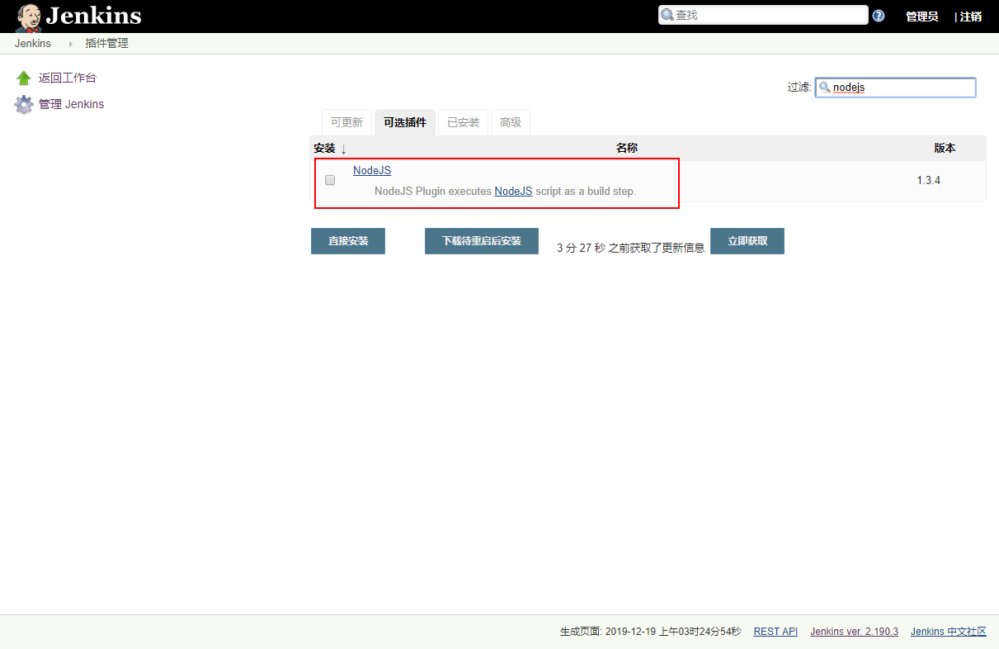

# Jenkins一键打包部署前端应用

## 搭建环境

* [基于docker搭建云服务器环境](https://gitee.com/ecs-common-deploy/ecs-deploy-document/blob/master/ecs-docker-deploy.md)
* [jenkins配置教程](https://github.com/tuonioooo/engineering-management/blob/master/jenkins-ji-cheng/Jenkins%E9%85%8D%E7%BD%AE&%E6%8F%92%E4%BB%B6%E5%AE%89%E8%A3%85&%E9%A1%B9%E7%9B%AE%E6%9E%84%E5%BB%BA%E5%AE%9E%E6%88%98%E6%BC%94%E7%A4%BA.md)

## 部署

### 运行配置要求

CenterOS7.6版本，推荐4G以上内存。


### jenkins构建项目

#### 安装NodeJS插件

1)、在 `系统管理`-> `插件管理` 中选择 `安装插件`


2)、搜索NodeJS插件并进行安装；



#### 配置NodeJS插件（安装node对应的安装包）

1)、在 `系统管理` -> `全局工具配置` 中进行 插件配置


2)、选择`新增NodeJS`，这里提供两种配置方式

* 第一种 自动安装


> 说明：  
> 此种方式简单，网络好的情况下，下载确实方便，如果网络不好，呵呵，等吧。  
> 有的时候会出现，版本下拉列表为空的情况，需要切换插件安装的中心地址才可以解决问题  
> 我的解决方式：  
> 首先，在没安装插件前我的中心地址是 `http://mirrors.tuna.tsinghua.edu.cn/jenkins/updates/current/update-center.json`  
> 当我安装时，发现版本列表选择为空 我更换了 中心地址 `http://updates.jenkins.io/update-center.json` 重启后，可以选择版本号选择  
> 但是安装时，我又换回来我原来的中心地址 `http://mirrors.tuna.tsinghua.edu.cn/jenkins/updates/current/update-center.json` 重启后，也可以选择版本号了  
> 最后就是下载特别慢，等吧

* 第二种 手动安装（推荐）


> 说明：  
> 官网手动下载，`https://nodejs.org/dist/v18.12.1/node-v18.12.1-linux-x64.tar.xz` 选择已经编译好的`tar.xz` 文件格式，解压即可使用，放到对应jenkins工作目录即可（jenkins其他插件安装都可以安装此方式，譬如maven）
> 最后说明一下，就是手动安装老快了，可以试试（选择迅雷或者国内镜像源下载贼快 `https://mirrors.huaweicloud.com/nodejs/`）


#### 创建任务

1)、任务执行流程如下


2)、构建一个自由风格的软件项目


3)、参数化构建过程


内容

```text
别名：init
描述：初始化构建Web项目 ，值为 true、false，  shell 中的使用方式: $init
#----------------------------华丽的分割线-------------------------
别名：install
描述：安装package ，值为 true、false，  true: 安装 false: 不安装  ，shell 中的使用方式: $install
```

4)、源码管理


git

```text
https://gitee.com/miliqk-org/miliqk-manage.git
```

5)、`构建环境` 中添加node


6)、添加shell执行脚本编译打包


脚本的内容

```shell
#第一次构建 查看node的版本
npm -v

#Error: error:0308010C:digital envelope routines::unsupported
export NODE_OPTIONS=--openssl-legacy-provider

if [ $init = "true" ]; then
	
	#将镜像源替换为淘宝的加速访问
	npm config set registry https://registry.npm.taobao.org    
    
	#安装 yarn、tyarn依赖包
    npm install yarn tyarn -g
         
    #查看yarn安装后的版本
    yarn --version
         
    #配置数据源
    yarn config set registry https://registry.npm.taobao.org -g
	yarn config set sass_binary_site http://cdn.npm.taobao.org/dist/node-sass -g
	    
fi

cd miliqk-manage-web-v5/

if [ $install = "true" ]; then
	#安装依赖包
	yarn
fi

npm run build:test
```

7)、将打包后的dist文件夹里的文件 传输到指定的位置统一管理


