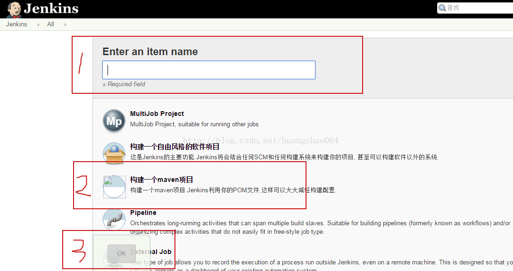
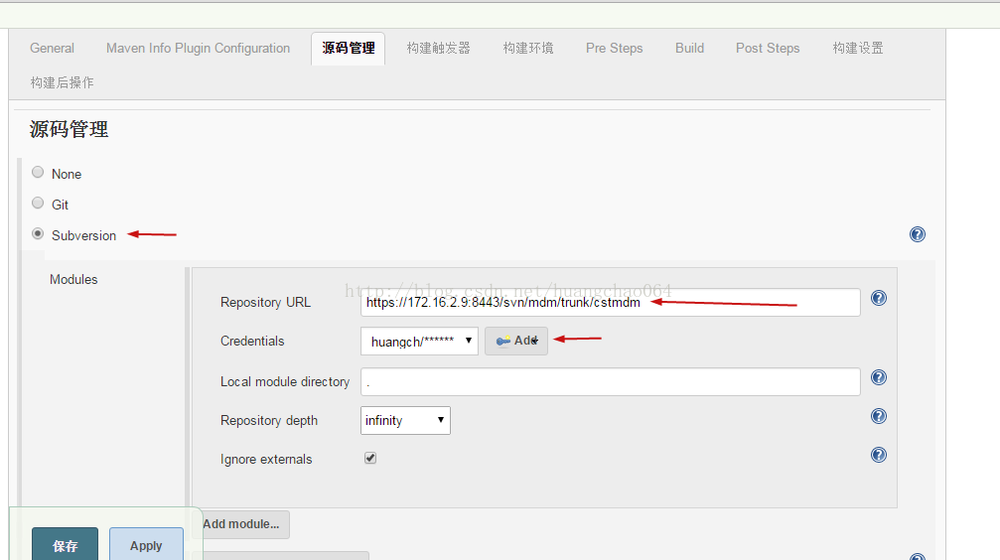
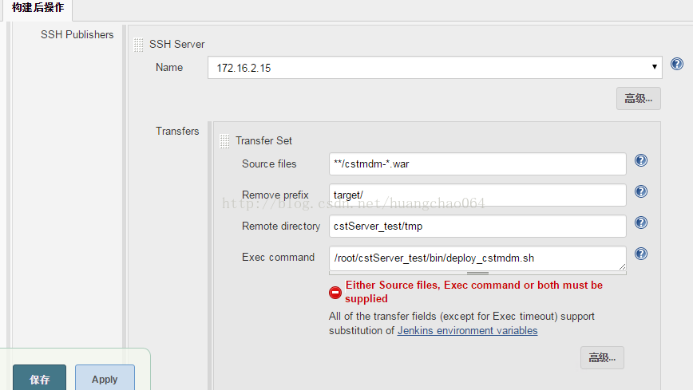
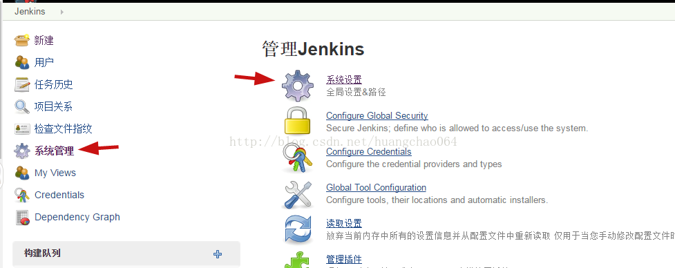
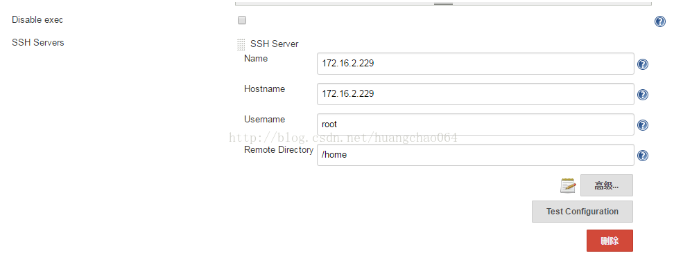
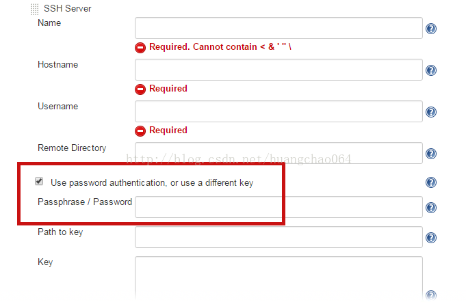

# Jenkins部署远程服务器（jenkins+svn+maven）

1、首先你得有个jenkins部署到服务器上面。关于jenkins如何安装部署百度一大堆，安装很简单，这里就不多讲了。

2、我这边jenkins的版本是2.32.3，不同版本界面略微有所不同，但大体一致

3、登录进去，如下图


4、我们点击左上角的【新建】按钮，出现如下图



按顺序，输入一个名字，自己想好就行，最好要有意义的，方便区别，然后选择构建一个maven项目，然后点击最下面的OK按钮，出现如下图


5、往下翻到源码管理这个地方



我这边工程是在svn上，所以我选择svn，然后输入工程的地址，选择用户，如果第一次进去没有，点击旁边的Add按钮，新增用户密码，这个是svn的用户和密码，用于jenkins自动帮你下载最新代码进行打包。

6、继续往下翻，到最下面的构建后操作。这个操作是关键步骤


选择Send build artifacts over SSH，选择以后出现如下图



这时候选择你要的服务器，这时候是不是发现你没有服务器可以选择，别着急，先看完，后面会讲如何添加远程服务器。

Sourec files这个是配置war包的

Remove prefix这个是移除前缀目录的，主要是我的war包在根目录下面的target下面，所以要移除target这个目录

Remote directory 这个目录要传送war包到目标服务器的目录，这个很关键。

Exec command 这个是要执行的远程脚本目录，主要是用于tomcat的重启，部署，达到自动化部署的目的，如果不写脚本，那就jenkins只能帮你把war包传到目标服务器而已。

然后，然后就点保存，这样就完成了。

7、好了，我们来配置上面说的远程服务器的地址，返回到主页面，选择系统管理-系统设置，如下图



选择系统设置后，出现如下图


然后往下翻，翻到Publish over SSH，如下图



这里就是配置远程服务器的地方。

name：自己随便取，方便记忆就行

Hostname:就是远程服务器的地址

Usename:就是用户名

Remote Directory：这个目录是传输war的最前面的目录。这个很重要，跟上面构建后操作的Remote Directory是会合并到一起的，比如我上面构建后操作中配置的

RemoteDirectory是cstServer\_test/tmp，然后这边远程服务器的Remote Directory配置的是/root，那么war包传输过去路径是/root/cstServer\_test/tmp目录。

然后密码呢？

别着急，点击旁边的高级就是出现密码输入框，如果是新增的话，点击高级以后还要勾选Use password authentication....这个选项才会出现密码输入框，如下图



好了，到这里就完成远程服务器配置了。刚才如果没配置好，返回去重新配置一下就行了。

8、然后我们来写远程服务器的shell脚本

```text
#!/bin/sh
export JAVA_HOME=/usr/java/jdk1.7.0_75
kill -9 $(ps -aef | grep tomcat/conf | grep -v grep | awk '{print $2}')
cd /app/programs/tomcat_test1/webapps
mv ROOT.war ROOT_`date +%Y%m%d%H%M%S`.war.bak
#rm -rf ROOT
mv  /app/programs/temp/mvcDemo3*-SNAPSHOT.war ROOT.war
cd /app/programs/tomcat_test1/bin
./startup.sh
```

这个要放在刚才配置的目录下面，就是文件所在的目录要跟刚才配置的Exec command目录一致就行了。

这样就可以开始构建了。如果目录配置都没有问题的话，就能正常自动部署。

参考：

[https://blog.csdn.net/huangchao064/article/details/73604980](https://blog.csdn.net/huangchao064/article/details/73604980)

