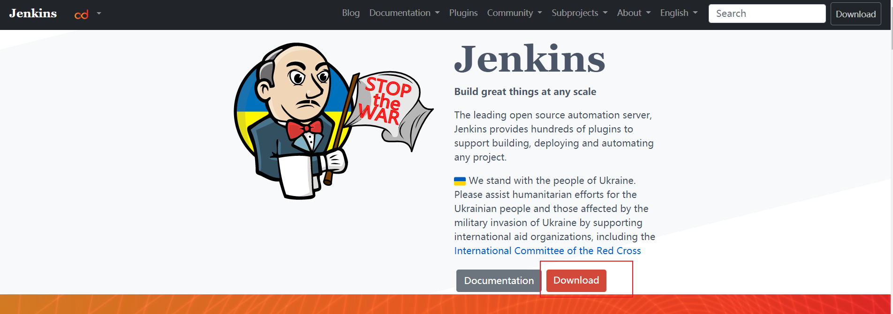
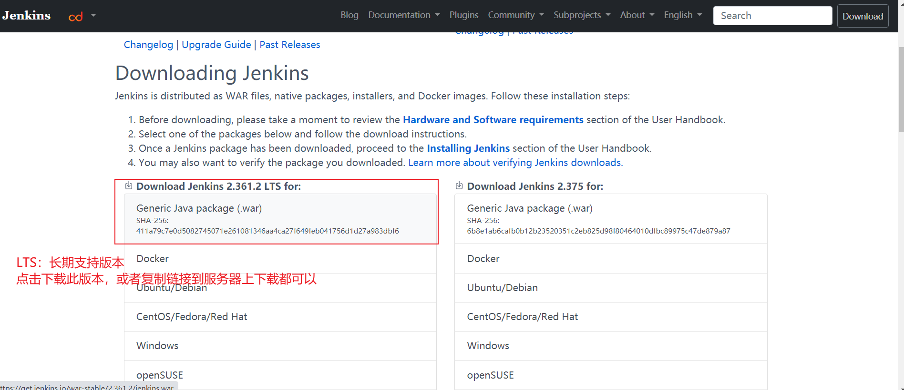
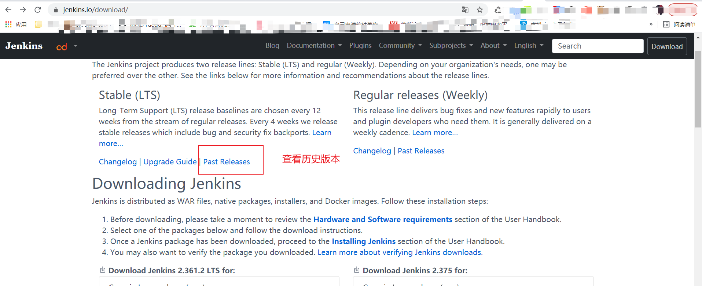
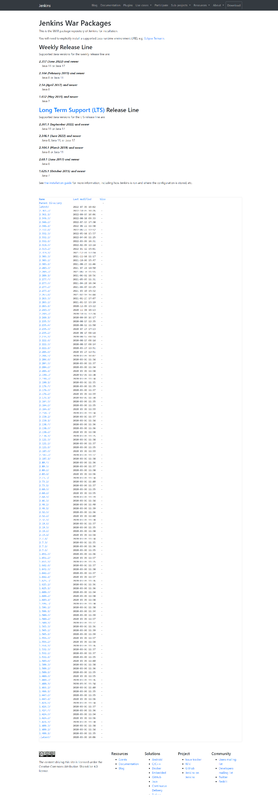
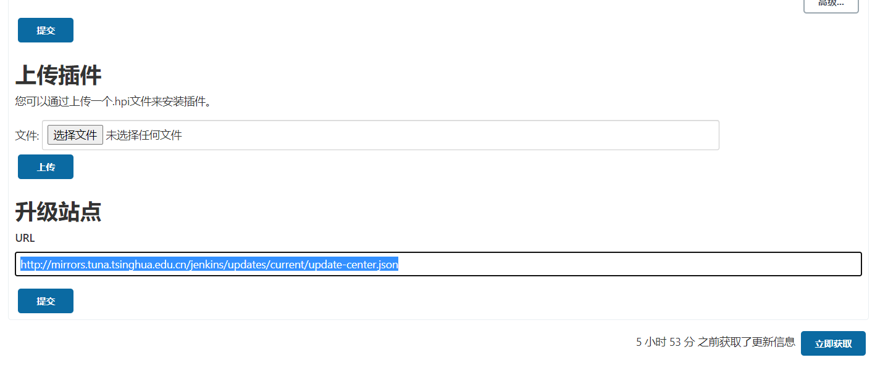

# Jenkins的war包安装

## 安装条件

对于本次旅行，您将需要：

* 一台机器：
  * 256 MB的RAM，但推荐超过512 MB
  * 10 GB的驱动器空间（适用于Jenkins和Docker镜像）
* 安装了以下软件：
  * Java 8（JRE或Java开发工具包（JDK）很好）
  * [Docker](https://docs.docker.com/)（导航到网站顶部的**获取Docker**以访问适合您平台的Docker下载，可以先不用下载）

## 下载Jenkins

[Jenkins官方网站](https://www.jenkins.io)如下图所示：



点击download，如下图所示：



这里选择的是支持Java8的版本，通过Past releases 链接 查看，如图所示：





```
$ wget http://mirrors.tuna.tsinghua.edu.cn/jenkins/war-stable/2.346.1/jenkins.war
```
> 复制链接后，采用`http`协议 wget下载war包

## 启动Jenkins

windows环境：

```text
D:\worksp\yiibai.com> java -jar Jenkins.war
```

Linux环境：

```text
[root@god local]# java -jar jenkins.war &
```

该命令后，各项任务将运行，其中一个是由名为 winstone 的嵌入式web服务器进行 war 文件提取。

```text
七月 31, 2018 11:55:08 上午 jenkins.InitReactorRunner$1 onAttained
信息: Started all plugins
七月 31, 2018 11:55:08 上午 jenkins.InitReactorRunner$1 onAttained
信息: Augmented all extensions
七月 31, 2018 11:55:09 上午 jenkins.InitReactorRunner$1 onAttained
信息: Loaded all jobs
七月 31, 2018 11:55:10 上午 hudson.model.AsyncPeriodicWork$1 run
信息: Started Download metadata
七月 31, 2018 11:55:12 上午 hudson.model.AsyncPeriodicWork$1 run
信息: Finished Download metadata. 1,517 ms
七月 31, 2018 11:55:13 上午 org.springframework.context.support.AbstractApplicationContext prepareRefresh
信息: Refreshing org.springframework.web.context.support.StaticWebApplicationContext@22315391: display name [Root WebApplicationContext]; startup date [Tue Jul 31 11:55:13 CST 2018]; root of context hierarchy
七月 31, 2018 11:55:13 上午 org.springframework.context.support.AbstractApplicationContext obtainFreshBeanFactory
信息: Bean factory for application context [org.springframework.web.context.support.StaticWebApplicationContext@22315391]: org.springframework.beans.factory.support.DefaultListableBeanFactory@29e568e8
七月 31, 2018 11:55:13 上午 org.springframework.beans.factory.support.DefaultListableBeanFactory preInstantiateSingletons
信息: Pre-instantiating singletons in org.springframework.beans.factory.support.DefaultListableBeanFactory@29e568e8: defining beans [authenticationManager]; root of factory hierarchy
七月 31, 2018 11:55:13 上午 org.springframework.context.support.AbstractApplicationContext prepareRefresh
信息: Refreshing org.springframework.web.context.support.StaticWebApplicationContext@4808dc00: display name [Root WebApplicationContext]; startup date [Tue Jul 31 11:55:13 CST 2018]; root of context hierarchy
七月 31, 2018 11:55:13 上午 org.springframework.context.support.AbstractApplicationContext obtainFreshBeanFactory
信息: Bean factory for application context [org.springframework.web.context.support.StaticWebApplicationContext@4808dc00]: org.springframework.beans.factory.support.DefaultListableBeanFactory@6567b115
七月 31, 2018 11:55:13 上午 org.springframework.beans.factory.support.DefaultListableBeanFactory preInstantiateSingletons
信息: Pre-instantiating singletons in org.springframework.beans.factory.support.DefaultListableBeanFactory@6567b115: defining beans [filter,legacy]; root of factory hierarchy
七月 31, 2018 11:55:14 上午 jenkins.InitReactorRunner$1 onAttained
信息: Completed initialization
七月 31, 2018 11:55:14 上午 hudson.WebAppMain$3 run
信息: Jenkins is fully up and running
```
war包命令进阶

```
#提供war包命令使用规则
java -jar jenkins.war --help 
#示例1：指定端口号
java -jar jenkins.war --httpPort=8081
#示例2：指定输出日志文件位置
java -jar jenkins.war --httpPort=8081 --logfile=/home/jenkins/log/jenkins.log &
#示例2：指定访问前缀
java -jar jenkins.war --httpPort=8081 --logfile=/home/jenkins/log/jenkins.log --prefix=/jenkins
```
> 说明：当你指定端口号时，需要记得开通防火墙哟执行如下代码(PS: 貌似docker挂载宿主端口貌似自动打开，省去这步操作的麻烦)
> `firewall-cmd --zone=public --add-port=8080/tcp --permanent`
> `firewall-cmd --reload`


配置插件站点地址



配置后，需要重启，否则不生效

> 说明： 配置插件站点地址，是为了防止国外站点链接超时或者下载插件缓慢，这里采用是
> `http://mirrors.tuna.tsinghua.edu.cn/jenkins/updates/current/update-center.json` 清华大学镜像地址
> 切记是`http`协议格式
> 上面页面访问路径是：系统管理（Manage Jenkins）--》插件管理（Manage Plugins）--》高级

## jenkins安装war包遇到的问题

1.Caused by: sun.security.validator.ValidatorException: PKIX path building failed: sun.security.provider.certpath.SunCertPathBuilderException: unable to find valid certification path to requested target

**参考：**

[解决 PKIX：unable to find valid certification path to requested target](http://bijian1013.iteye.com/blog/2310856)

原因是就是升级站点的链接[https://updates.jenkins.io/update-center.json默认是https的，如何解决呢？](https://updates.jenkins.io/update-center.json默认是https的，如何解决呢？)

**解决方案1:**

安装插件那个页面，就是提示你offline的那个页面，跳过插件继续安装，直至安装完，然后打开一个新的tab，输入网址[http://localhost:8080/jenkins/pluginManager/advanced。](http://localhost:8080/jenkins/pluginManager/advanced。) 这里面最底下有个【升级站点】，把其中的链接由https改成http的就好了，[http://updates.jenkins.io/update-center.json](http://updates.jenkins.io/update-center.json)。 然后在服务列表中关闭jenkins，再tomcat重新启动，这样就能正常联网了

参考：[Jenkenis报错：该jenkins实例似乎已离线](https://www.jianshu.com/p/3a71f8b84289)

**解决方案2：**

当然，原则上也可以参考解决PKIX的第二种方式，为updates.jenkins.io生成证书并导入到JAVA\_HOME/jre/lib/security目录下，具体操作流程如下：

InstallCert.java

```text
/*
 * Copyright 2006 Sun Microsystems, Inc.  All Rights Reserved.
 *
 * Redistribution and use in source and binary forms, with or without
 * modification, are permitted provided that the following conditions
 * are met:
 *
 *   - Redistributions of source code must retain the above copyright
 *     notice, this list of conditions and the following disclaimer.
 *
 *   - Redistributions in binary form must reproduce the above copyright
 *     notice, this list of conditions and the following disclaimer in the
 *     documentation and/or other materials provided with the distribution.
 *
 *   - Neither the name of Sun Microsystems nor the names of its
 *     contributors may be used to endorse or promote products derived
 *     from this software without specific prior written permission.
 *
 * THIS SOFTWARE IS PROVIDED BY THE COPYRIGHT HOLDERS AND CONTRIBUTORS "AS
 * IS" AND ANY EXPRESS OR IMPLIED WARRANTIES, INCLUDING, BUT NOT LIMITED TO,
 * THE IMPLIED WARRANTIES OF MERCHANTABILITY AND FITNESS FOR A PARTICULAR
 * PURPOSE ARE DISCLAIMED.  IN NO EVENT SHALL THE COPYRIGHT OWNER OR
 * CONTRIBUTORS BE LIABLE FOR ANY DIRECT, INDIRECT, INCIDENTAL, SPECIAL,
 * EXEMPLARY, OR CONSEQUENTIAL DAMAGES (INCLUDING, BUT NOT LIMITED TO,
 * PROCUREMENT OF SUBSTITUTE GOODS OR SERVICES; LOSS OF USE, DATA, OR
 * PROFITS; OR BUSINESS INTERRUPTION) HOWEVER CAUSED AND ON ANY THEORY OF
 * LIABILITY, WHETHER IN CONTRACT, STRICT LIABILITY, OR TORT (INCLUDING
 * NEGLIGENCE OR OTHERWISE) ARISING IN ANY WAY OUT OF THE USE OF THIS
 * SOFTWARE, EVEN IF ADVISED OF THE POSSIBILITY OF SUCH DAMAGE.
 */

import java.io.*;
import java.net.URL;

import java.security.*;
import java.security.cert.*;

import javax.net.ssl.*;

public class InstallCert {

    public static void main(String[] args) throws Exception {
    String host;
    int port;
    char[] passphrase;
    if ((args.length == 1) || (args.length == 2)) {
        String[] c = args[0].split(":");
        host = c[0];
        port = (c.length == 1) ? 443 : Integer.parseInt(c[1]);
        String p = (args.length == 1) ? "changeit" : args[1];
        passphrase = p.toCharArray();
    } else {
        System.out.println("Usage: java InstallCert <host>[:port] [passphrase]");
        return;
    }

    File file = new File("jssecacerts");
    if (file.isFile() == false) {
        char SEP = File.separatorChar;
        File dir = new File(System.getProperty("java.home") + SEP
            + "lib" + SEP + "security");
        file = new File(dir, "jssecacerts");
        if (file.isFile() == false) {
        file = new File(dir, "cacerts");
        }
    }
    System.out.println("Loading KeyStore " + file + "...");
    InputStream in = new FileInputStream(file);
    KeyStore ks = KeyStore.getInstance(KeyStore.getDefaultType());
    ks.load(in, passphrase);
    in.close();

    SSLContext context = SSLContext.getInstance("TLS");
    TrustManagerFactory tmf =
        TrustManagerFactory.getInstance(TrustManagerFactory.getDefaultAlgorithm());
    tmf.init(ks);
    X509TrustManager defaultTrustManager = (X509TrustManager)tmf.getTrustManagers()[0];
    SavingTrustManager tm = new SavingTrustManager(defaultTrustManager);
    context.init(null, new TrustManager[] {tm}, null);
    SSLSocketFactory factory = context.getSocketFactory();

    System.out.println("Opening connection to " + host + ":" + port + "...");
    SSLSocket socket = (SSLSocket)factory.createSocket(host, port);
    socket.setSoTimeout(10000);
    try {
        System.out.println("Starting SSL handshake...");
        socket.startHandshake();
        socket.close();
        System.out.println();
        System.out.println("No errors, certificate is already trusted");
    } catch (SSLException e) {
        System.out.println();
        e.printStackTrace(System.out);
    }

    X509Certificate[] chain = tm.chain;
    if (chain == null) {
        System.out.println("Could not obtain server certificate chain");
        return;
    }

    BufferedReader reader =
        new BufferedReader(new InputStreamReader(System.in));

    System.out.println();
    System.out.println("Server sent " + chain.length + " certificate(s):");
    System.out.println();
    MessageDigest sha1 = MessageDigest.getInstance("SHA1");
    MessageDigest md5 = MessageDigest.getInstance("MD5");
    for (int i = 0; i < chain.length; i++) {
        X509Certificate cert = chain[i];
        System.out.println
            (" " + (i + 1) + " Subject " + cert.getSubjectDN());
        System.out.println("   Issuer  " + cert.getIssuerDN());
        sha1.update(cert.getEncoded());
        System.out.println("   sha1    " + toHexString(sha1.digest()));
        md5.update(cert.getEncoded());
        System.out.println("   md5     " + toHexString(md5.digest()));
        System.out.println();
    }

    System.out.println("Enter certificate to add to trusted keystore or 'q' to quit: [1]");
    String line = reader.readLine().trim();
    int k;
    try {
        k = (line.length() == 0) ? 0 : Integer.parseInt(line) - 1;
    } catch (NumberFormatException e) {
        System.out.println("KeyStore not changed");
        return;
    }

    X509Certificate cert = chain[k];
    String alias = host + "-" + (k + 1);
    ks.setCertificateEntry(alias, cert);

    OutputStream out = new FileOutputStream("jssecacerts");
    ks.store(out, passphrase);
    out.close();

    System.out.println();
    System.out.println(cert);
    System.out.println();
    System.out.println
        ("Added certificate to keystore 'jssecacerts' using alias '"
        + alias + "'");
    }

    private static final char[] HEXDIGITS = "0123456789abcdef".toCharArray();

    private static String toHexString(byte[] bytes) {
    StringBuilder sb = new StringBuilder(bytes.length * 3);
    for (int b : bytes) {
        b &= 0xff;
        sb.append(HEXDIGITS[b >> 4]);
        sb.append(HEXDIGITS[b & 15]);
        sb.append(' ');
    }
    return sb.toString();
    }

    private static class SavingTrustManager implements X509TrustManager {

    private final X509TrustManager tm;
    private X509Certificate[] chain;

    SavingTrustManager(X509TrustManager tm) {
        this.tm = tm;
    }

    public X509Certificate[] getAcceptedIssuers() {
        throw new UnsupportedOperationException();
    }

    public void checkClientTrusted(X509Certificate[] chain, String authType)
        throws CertificateException {
        throw new UnsupportedOperationException();
    }

    public void checkServerTrusted(X509Certificate[] chain, String authType)
        throws CertificateException {
        this.chain = chain;
        tm.checkServerTrusted(chain, authType);
    }
    }

}
```

编译InstallCert.java：javac InstallCert.java

运行InstallCert.java：java InstallCert updates.jenkins.io

或者通过其他开发工具进行编译运行

运行输出：

```text
Loading KeyStore jssecacerts...
Opening connection to updates.jenkins.io:443...
Starting SSL handshake...

javax.net.ssl.SSLHandshakeException: sun.security.validator.ValidatorException: PKIX path building failed: sun.security.provider.certpath.SunCertPathBuilderException: unable to find valid certification path to requested target
    at sun.security.ssl.Alerts.getSSLException(Alerts.java:192)
    at sun.security.ssl.SSLSocketImpl.fatal(SSLSocketImpl.java:1949)
    at sun.security.ssl.Handshaker.fatalSE(Handshaker.java:302)
    at sun.security.ssl.Handshaker.fatalSE(Handshaker.java:296)
    at sun.security.ssl.ClientHandshaker.serverCertificate(ClientHandshaker.java:1509)
    at sun.security.ssl.ClientHandshaker.processMessage(ClientHandshaker.java:216)
    at sun.security.ssl.Handshaker.processLoop(Handshaker.java:979)
    at sun.security.ssl.Handshaker.process_record(Handshaker.java:914)
    at sun.security.ssl.SSLSocketImpl.readRecord(SSLSocketImpl.java:1062)
    at sun.security.ssl.SSLSocketImpl.performInitialHandshake(SSLSocketImpl.java:1375)
    at sun.security.ssl.SSLSocketImpl.startHandshake(SSLSocketImpl.java:1403)
    at sun.security.ssl.SSLSocketImpl.startHandshake(SSLSocketImpl.java:1387)
    at com.master.InstallCert.main(InstallCert.java:75)
Caused by: sun.security.validator.ValidatorException: PKIX path building failed: sun.security.provider.certpath.SunCertPathBuilderException: unable to find valid certification path to requested target
    at sun.security.validator.PKIXValidator.doBuild(PKIXValidator.java:387)
    at sun.security.validator.PKIXValidator.engineValidate(PKIXValidator.java:292)
    at sun.security.validator.Validator.validate(Validator.java:260)
    at sun.security.ssl.X509TrustManagerImpl.validate(X509TrustManagerImpl.java:324)
    at sun.security.ssl.X509TrustManagerImpl.checkTrusted(X509TrustManagerImpl.java:229)
    at sun.security.ssl.X509TrustManagerImpl.checkServerTrusted(X509TrustManagerImpl.java:105)
    at com.master.InstallCert$SavingTrustManager.checkServerTrusted(InstallCert.java:173)
    at sun.security.ssl.AbstractTrustManagerWrapper.checkServerTrusted(SSLContextImpl.java:922)
    at sun.security.ssl.ClientHandshaker.serverCertificate(ClientHandshaker.java:1491)
    ... 8 more
Caused by: sun.security.provider.certpath.SunCertPathBuilderException: unable to find valid certification path to requested target
    at sun.security.provider.certpath.SunCertPathBuilder.build(SunCertPathBuilder.java:141)
    at sun.security.provider.certpath.SunCertPathBuilder.engineBuild(SunCertPathBuilder.java:126)
    at java.security.cert.CertPathBuilder.build(CertPathBuilder.java:280)
    at sun.security.validator.PKIXValidator.doBuild(PKIXValidator.java:382)
    ... 16 more

Server sent 2 certificate(s):

 1 Subject CN=updates.jenkins.io
   Issuer  CN=Let's Encrypt Authority X3, O=Let's Encrypt, C=US
   sha1    5c 24 33 9c aa f3 18 77 47 13 4e 6a 3b fd 78 cf 05 76 76 7d 
   md5     b5 8f 7f 7c d8 a4 b4 30 7c 1b e4 d2 9d b0 66 f5 

 2 Subject CN=Let's Encrypt Authority X3, O=Let's Encrypt, C=US
   Issuer  CN=DST Root CA X3, O=Digital Signature Trust Co.
   sha1    e6 a3 b4 5b 06 2d 50 9b 33 82 28 2d 19 6e fe 97 d5 95 6c cb 
   md5     b1 54 09 27 4f 54 ad 8f 02 3d 3b 85 a5 ec ec 5d 

Enter certificate to add to trusted keystore or 'q' to quit: [1]
```

输出控制台，输出1

```text
[
[
  Version: V3
  Subject: CN=updates.jenkins.io
  Signature Algorithm: SHA256withRSA, OID = 1.2.840.113549.1.1.11

  Key:  Sun RSA public key, 2048 bits
  modulus: 24648709359951803528495417126308916624559015437914056413101936903557165322116751704176498885584821501904043802084052758676816015955054954699732949834251295871409914012635755929400351576172837246948097448156050640611115697558474462540241453772315776175513304577897234674804585517435978161076749014201842008143754883712909080815078537972228238647068261006277227224675210730173544592749106294594082740598123867965220257753606893263874016791234227841416036515725796120793124631913517588835147735626473128320595041820170600091643555202518265562438315728484094977459535968761133289508266483326277115964451104918067684855513
  public exponent: 65537
  Validity: [From: Fri Jun 01 08:55:13 CST 2018,
               To: Thu Aug 30 08:55:13 CST 2018]
  Issuer: CN=Let's Encrypt Authority X3, O=Let's Encrypt, C=US
  SerialNumber: [    0300ee80 33bb1a88 f4425fbf 9a66f96d a718]

Certificate Extensions: 9
[1]: ObjectId: 1.3.6.1.4.1.11129.2.4.2 Criticality=false
Extension unknown: DER encoded OCTET string =
0000: 04 81 F6 04 81 F3 00 F1   00 76 00 55 81 D4 C2 16  .........v.U....
0010: 90 36 01 4A EA 0B 9B 57   3C 53 F0 C0 E4 38 78 70  .6.J...W<S...8xp
0020: 25 08 17 2F A3 AA 1D 07   13 D3 0C 00 00 01 63 B9  %../..........c.
0030: 0E 52 2B 00 00 04 03 00   47 30 45 02 21 00 EC 13  .R+.....G0E.!...
0040: DE C6 BD C0 89 4C A0 A4   EF 5E 86 FC D5 BC 83 20  .....L...^..... 
0050: EA B0 9A 8E 4C 8D 04 96   56 47 F9 E9 76 1E 02 20  ....L...VG..v.. 
0060: 62 EE 5D AD 7C 9B 22 DC   A9 27 E1 2B E8 B8 46 FD  b.]..."..'.+..F.
0070: E3 A5 66 E8 11 5E EE BD   B8 2C 6A D6 73 2A 41 39  ..f..^...,j.s*A9
0080: 00 77 00 29 3C 51 96 54   C8 39 65 BA AA 50 FC 58  .w.)<Q.T.9e..P.X
0090: 07 D4 B7 6F BF 58 7A 29   72 DC A4 C3 0C F4 E5 45  ...o.Xz)r......E
00A0: 47 F4 78 00 00 01 63 B9   0E 52 7F 00 00 04 03 00  G.x...c..R......
00B0: 48 30 46 02 21 00 DA 90   1B 36 B6 D5 48 25 AC BB  H0F.!....6..H%..
00C0: E4 4D 05 19 6F D2 2B 75   15 7F 5A CE E7 C7 38 07  .M..o.+u..Z...8.
00D0: 43 A1 7D D0 A4 92 02 21   00 97 64 8F A8 F5 02 BE  C......!..d.....
00E0: 12 FE D2 C3 20 8B F3 45   B5 AF 94 C9 41 24 EF DF  .... ..E....A$..
00F0: 9C 6A C2 E6 79 A9 E7 42   57                       .j..y..BW


[2]: ObjectId: 1.3.6.1.5.5.7.1.1 Criticality=false
AuthorityInfoAccess [
  [
   accessMethod: ocsp
   accessLocation: URIName: http://ocsp.int-x3.letsencrypt.org
, 
   accessMethod: caIssuers
   accessLocation: URIName: http://cert.int-x3.letsencrypt.org/
]
]

[3]: ObjectId: 2.5.29.35 Criticality=false
AuthorityKeyIdentifier [
KeyIdentifier [
0000: A8 4A 6A 63 04 7D DD BA   E6 D1 39 B7 A6 45 65 EF  .Jjc......9..Ee.
0010: F3 A8 EC A1                                        ....
]
]

[4]: ObjectId: 2.5.29.19 Criticality=true
BasicConstraints:[
  CA:false
  PathLen: undefined
]

[5]: ObjectId: 2.5.29.32 Criticality=false
CertificatePolicies [
  [CertificatePolicyId: [2.23.140.1.2.1]
[]  ]
  [CertificatePolicyId: [1.3.6.1.4.1.44947.1.1.1]
[PolicyQualifierInfo: [
  qualifierID: 1.3.6.1.5.5.7.2.1
  qualifier: 0000: 16 1A 68 74 74 70 3A 2F   2F 63 70 73 2E 6C 65 74  ..http://cps.let
0010: 73 65 6E 63 72 79 70 74   2E 6F 72 67              sencrypt.org

], PolicyQualifierInfo: [
  qualifierID: 1.3.6.1.5.5.7.2.2
  qualifier: 0000: 30 81 9E 0C 81 9B 54 68   69 73 20 43 65 72 74 69  0.....This Certi
0010: 66 69 63 61 74 65 20 6D   61 79 20 6F 6E 6C 79 20  ficate may only 
0020: 62 65 20 72 65 6C 69 65   64 20 75 70 6F 6E 20 62  be relied upon b
0030: 79 20 52 65 6C 79 69 6E   67 20 50 61 72 74 69 65  y Relying Partie
0040: 73 20 61 6E 64 20 6F 6E   6C 79 20 69 6E 20 61 63  s and only in ac
0050: 63 6F 72 64 61 6E 63 65   20 77 69 74 68 20 74 68  cordance with th
0060: 65 20 43 65 72 74 69 66   69 63 61 74 65 20 50 6F  e Certificate Po
0070: 6C 69 63 79 20 66 6F 75   6E 64 20 61 74 20 68 74  licy found at ht
0080: 74 70 73 3A 2F 2F 6C 65   74 73 65 6E 63 72 79 70  tps://letsencryp
0090: 74 2E 6F 72 67 2F 72 65   70 6F 73 69 74 6F 72 79  t.org/repository
00A0: 2F                                                 /

]]  ]
]

[6]: ObjectId: 2.5.29.37 Criticality=false
ExtendedKeyUsages [
  serverAuth
  clientAuth
]

[7]: ObjectId: 2.5.29.15 Criticality=true
KeyUsage [
  DigitalSignature
  Key_Encipherment
]

[8]: ObjectId: 2.5.29.17 Criticality=false
SubjectAlternativeName [
  DNSName: updates.jenkins.io
]

[9]: ObjectId: 2.5.29.14 Criticality=false
SubjectKeyIdentifier [
KeyIdentifier [
0000: 94 F6 E9 90 97 04 EE 14   5B 00 30 FF F2 9E 05 83  ........[.0.....
0010: C4 14 31 7A                                        ..1z
]
]

]
  Algorithm: [SHA256withRSA]
  Signature:
0000: 65 DD 0D A6 85 41 01 66   10 F8 81 D4 9C 33 93 FC  e....A.f.....3..
0010: A9 76 DB 54 6F BC 0E B9   8E D8 90 A8 11 DC 9B CD  .v.To...........
0020: FD 0F DE 71 B3 EE 61 69   3A C4 A1 9F 63 FD 4D 3C  ...q..ai:...c.M<
0030: E5 04 EA ED 9E 6A AC 2D   21 69 F6 95 69 94 E8 8D  .....j.-!i..i...
0040: 09 73 65 E3 7A 9F 7A 68   E3 53 10 EE 56 F5 45 C5  .se.z.zh.S..V.E.
0050: 56 08 A3 17 F2 D6 0C D0   C4 7B 3E D4 65 52 2B 4F  V.........>.eR+O
0060: 19 4C 3F 7A F7 B5 0A BA   38 F0 A3 C1 CE 99 C9 0C  .L?z....8.......
0070: 00 11 40 81 8F F0 8D 8E   7E 21 C3 34 2E C7 66 D6  ..@......!.4..f.
0080: D1 64 C9 93 EE 6D F3 FF   0A 78 2D 61 A7 52 F8 26  .d...m...x-a.R.&
0090: 41 18 3E 2E 00 DB 04 7A   88 21 75 F7 05 46 F7 89  A.>....z.!u..F..
00A0: 74 46 D1 59 E8 1F 1B 15   5A 05 BD 3D 0F 68 5B 9F  tF.Y....Z..=.h[.
00B0: C7 3E 90 2D 8F 88 54 30   B2 31 8D 4F 2B EE D1 25  .>.-..T0.1.O+..%
00C0: DC CF 30 CC A1 89 12 89   FB C2 5F 23 19 5A 20 75  ..0......._#.Z u
00D0: 4C 2A 06 41 57 3A AC 35   F6 A7 E0 CF C7 C2 3D 71  L*.AW:.5......=q
00E0: 0F BA 50 66 DE 19 4E F4   3A 59 BE EB C4 56 A8 F5  ..Pf..N.:Y...V..
00F0: CE F0 72 6C 9B D6 23 BE   3C 95 58 EA C1 32 94 E9  ..rl..#.<.X..2..

]

Added certificate to keystore 'jssecacerts' using alias 'updates.jenkins.io-1'
```

会在当前目录或者你idea工程下生成一个jssecacerts文件，将其copy到JAVA\_HOME/jre/lib/security 目录下，

在重新运行Java -jar jenkins.jar即可解决问题

