# Jenkins配置&插件安装&项目构建实战演示

## 初始化向导

软件的安装参考：[Jenkins环境构建](./jenkinshuan-jing-gou-jian/README.md) 

系统安装成功后，通过浏览器访问 http:/ip:port/进入初始页，如果 Jenkins 还没有启动完成，会显示如下内容


启动完成后，要求输入初始的管理员密码，根据提示密码在/root/.jenkins/secrets/initialAdminPassword这个文件中，找到密码输入，点击继续

 

输入密码,成功进入页面

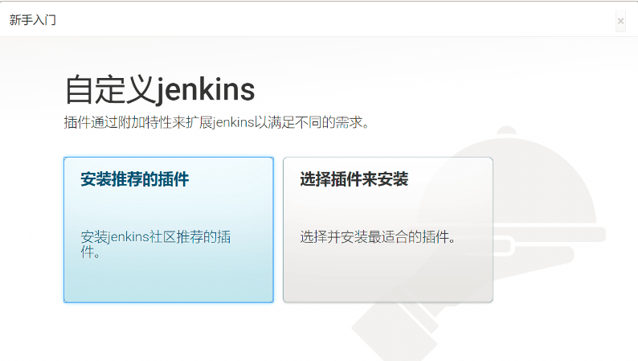

选择安装推荐的插件,插件安装成功后跳至此界面，创建账户

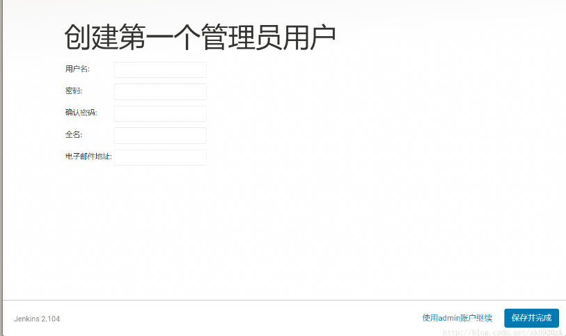

实例配置，保存并完成

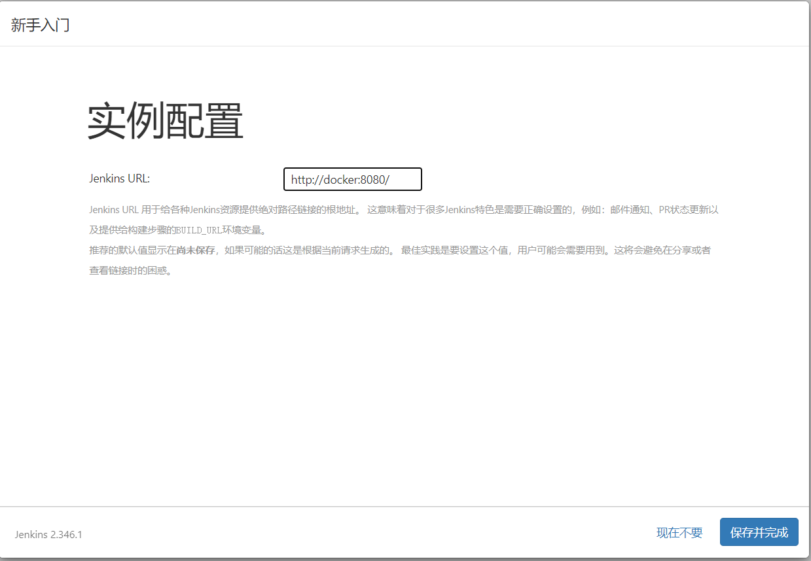

开始使用jenkins


跳转到首页

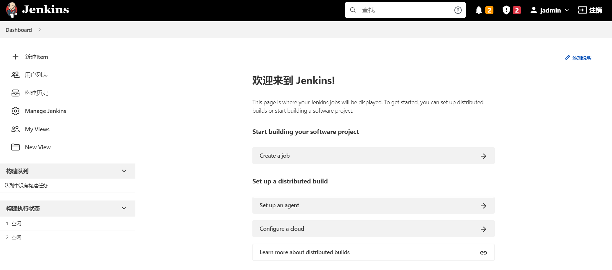

## 插件安装

### 配置插件站点地址


配置后，需要重启，否则不生效

> 说明： 配置插件站点地址，是为了防止国外站点链接超时或者下载插件缓慢，这里采用是
> `http://mirrors.tuna.tsinghua.edu.cn/jenkins/updates/current/update-center.json` 清华大学镜像地址
> 切记是`http`协议格式
> 上面页面访问路径是：系统管理（Manage Jenkins）--》插件管理（Manage Plugins）--》高级

### 安装汉化插件 Locale plugin、Localization: Chinese (Simplified)

下图是以前版本，需要下载两个插件


这个是当前版本，貌似需要下载一个插件即可

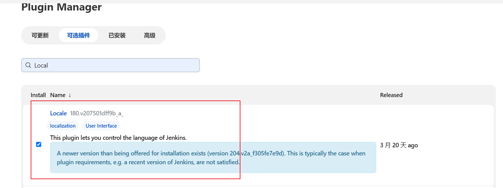

汉化时，可能会出现部分中文简体不翻译的情况，做如下操作：

安装好插件“Locale plugin”和“Localization: Chinese (Simplified)后，
在系统管理（Manage Jenkins）->系统设置（Manage Setting），面板中作如下操作，可以临时完美修复
1. 将语言设定为zh_US，Jenkins切换为英文。
2. 调用restart重启Jenkins：http://域名/restart。
3. 再次语言设定为zh_CN，刷新即可。

重启后，还是会出现部分中文简体不翻译的情况，这个不是特别重要

### 安装Publish Over SSH

在 `Manage Plugins` 中直接搜索安装即可

## 配置

### Linux系统配置

示例图如下：

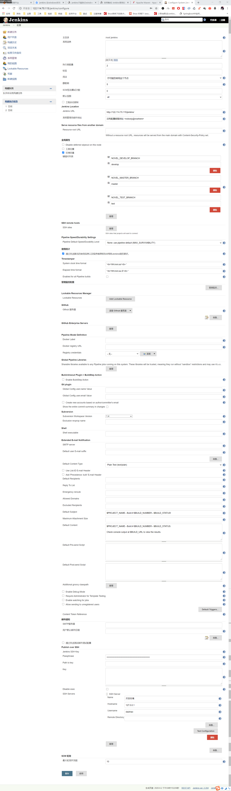

> 配置图说明：
> * `Jenkins Location` 用于配置jenkins访问URL
> * `环境变量`  配置好键值对 在构建项目时 可以 用 `${Key}` 形式使用变量 `key就是变量名`
> * `Publish over SSH` 如：  
>    Passphrase: **********（key的密码不是必须的）  
>    Path to key: /root/.ssh/id_rsa key (文件私钥的路径不是必须的)
> * `SSH Servers`  
>    Name: 名称  
     Hostname: 主机Ip  
     Username: 主机用户名  
     Remote Directory: 连接主机的目录 
  
### windows系统配置

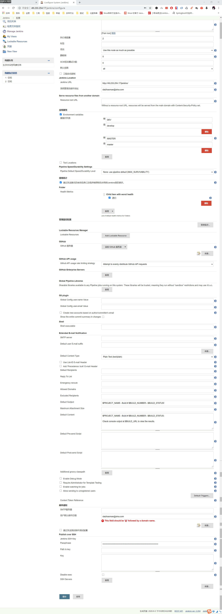
> 参数说明: 可以参考Linux配置

### Linux 全局工具配置

示例图如下：

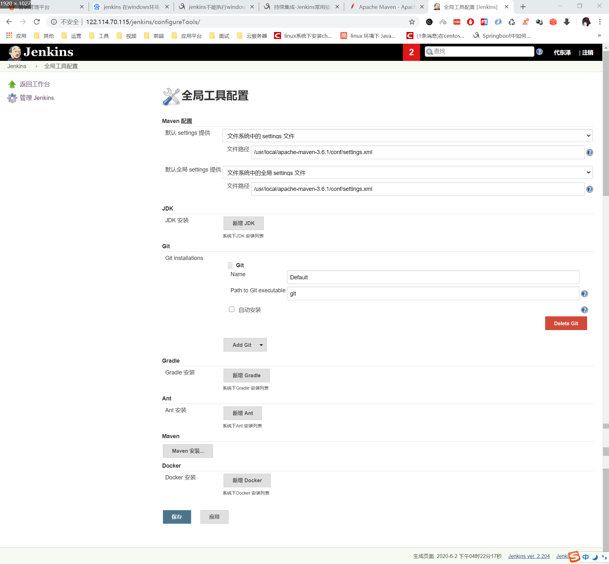

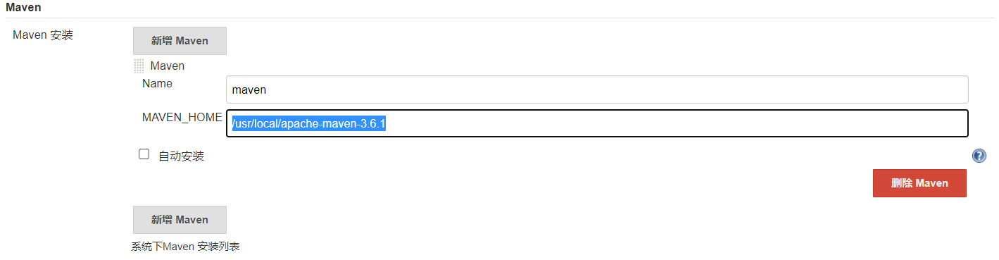

> 配置图说明：
> * `maven配置` 用于配置maven的配置文件
> * `maven 新增maven` 配置maven的主目录 `/usr/local/apache-maven-3.6.1` 
> * 其他配置默认即可

### windows 全局工具配置

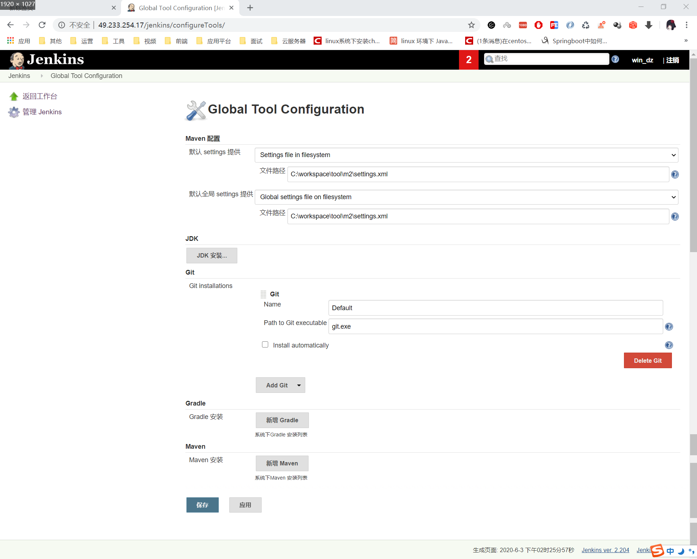

> 参数说明: 参考Linux 全局工具配置

## 项目构建（windows/Linux/其他平台都可以效仿）

### Linux项目构建

#### 单模块的打包配置实战图

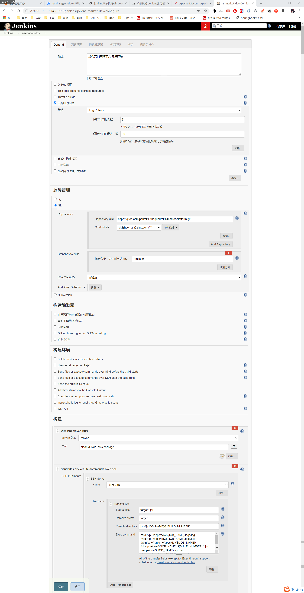

#### 多模块的打包配置实战图

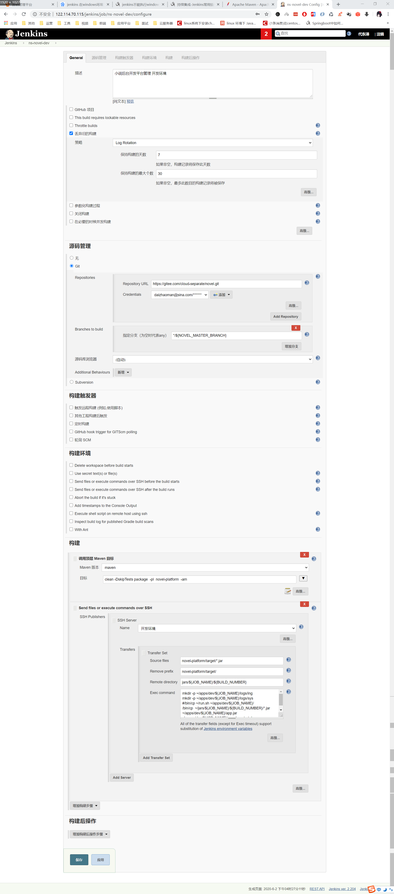

### Windows项目构建

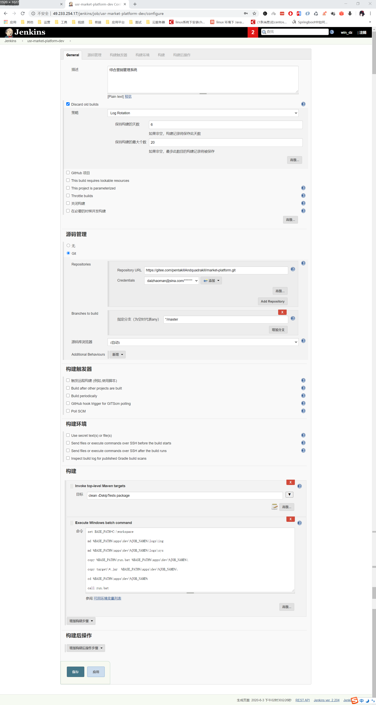

> 注意，这里采用的是windows  下的cmd命令模式及用bat脚本实现部署Java，具体可以参考本笔记本当中的bat脚本

## Jenkins项目构建中的 SSH Publishers 脚本代码

### Linux脚本代码  

#### 单模块传输
```
Source files：target/*.jar
Remove prefix：target/
Remote directory：jars/${JOB_NAME}/${BUILD_NUMBER}
Exec command: mkdir -p ~/apps/dev/${JOB_NAME}/logs/ing  
              mkdir -p ~/apps/dev/${JOB_NAME}/logs/sys  
              #/bin/cp ~/run.sh ~/apps/dev/${JOB_NAME}/  
              /bin/cp  ~/jars/${JOB_NAME}/${BUILD_NUMBER}/*.jar  ~/apps/dev/${JOB_NAME}/app.jar  
              sh apps/dev/${JOB_NAME}/run.sh restart dev  
```

#### 多模块传输
```
Source files：novel-platform/target/*.jar
Remove prefix：novel-platform/target/
Remote directory： jars/${JOB_NAME}/${BUILD_NUMBER}
Exec command: mkdir -p ~/apps/dev/${JOB_NAME}/logs/ing  
              mkdir -p ~/apps/dev/${JOB_NAME}/logs/sys  
              #/bin/cp ~/run.sh ~/apps/dev/${JOB_NAME}/  
              /bin/cp  ~/jars/${JOB_NAME}/${BUILD_NUMBER}/*.jar  ~/apps/dev/${JOB_NAME}/app.jar  
              sh apps/dev/${JOB_NAME}/run.sh restart dev  
```

[这个是执行jar包的shell脚本](../assets/run.sh)    

[这个是执行jenkins.war包的shell脚本](../assets/jenkins_run.sh)  

### windows脚本代码

```
set BASE_PATH=C:\workspace
md %BASE_PATH%\apps\dev\%JOB_NAME%\logs\ing
md %BASE_PATH%\apps\dev\%JOB_NAME%\logs\sys
copy %BASE_PATH%\run.bat %BASE_PATH%\apps\dev\%JOB_NAME%\
copy target\*.jar  %BASE_PATH%\apps\dev\%JOB_NAME%\
cd %BASE_PATH%\apps\dev\%JOB_NAME%
call run.bat
```  

[cnm，记住这个是执行jar命令的bat脚本1](../assets/run.bat)  

[cnm，记住这个是执行jar命令的bat脚本2](../assets/monitor.bat)  

[cnm，记住这个是执行jenkins.war包的bat脚本](../assets/jenkins_run.bat)
