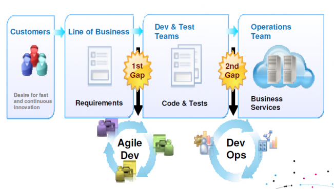
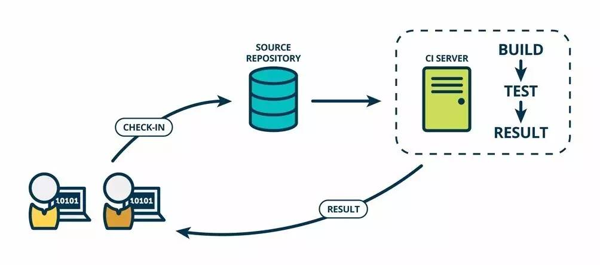
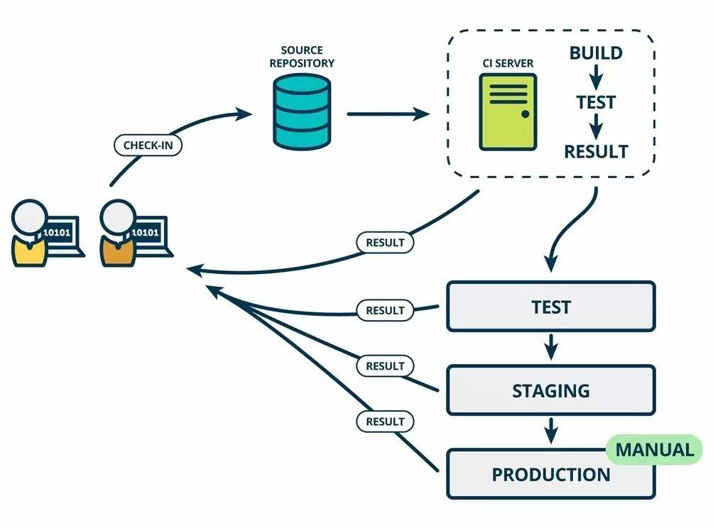
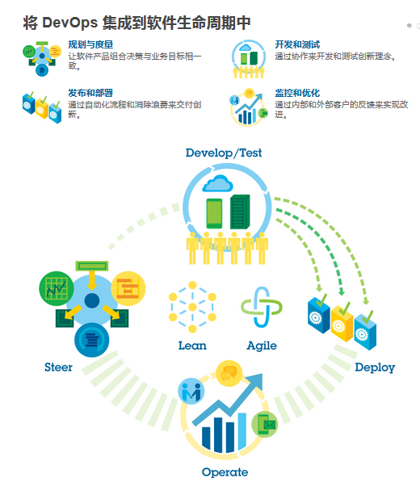
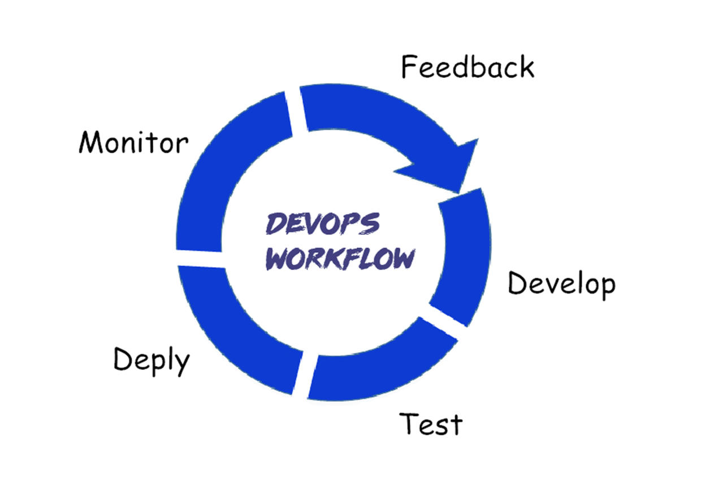

# DevOps持续集成介绍

## 前言

本以为DevOps与Docker无关了，没想到Docker在这个领域也是神一样的存在。Docker支持持续集成/持续交互\(CI/CD\)，Docker的目标是让我们的环境构建变得简单，让开发人员更关注自己的代码，同时也不需要运维介入，每一次代码的提交都可以实时地发布到对应的测试环境，提前验证代码的正确性。这之中持续集成最经典的案例当属Docker+Jenkins+Github的持续集成方案了，下一篇会详细描述实践过程。本文还是先来看看到底什么是DevOps,以及它的核心理念。

## 什么是DevOps

DevOps（Development和Operations的组合词）是一种重视“软件开发人员（Dev）”和“IT运维技术人员（Ops）”之间沟通合作的文化、运动或惯例。透过自动化“软件交付”和“架构变更”的流程，来使得构建、测试、发布软件能够更加地快捷、频繁和可靠。--[维基百科](https://zh.wikipedia.org/wiki/DevOps)

DevOps（英文Development和Operations的组合）是一组过程、方法与系统的统称，用于促进开发（应用程序/软件工程）、技术运营和质量保障（QA）部门之间的沟通、协作与整合。它的出现是由于软件行业日益清晰地认识到：为了按时交付软件产品和服务，开发和运营工作必须紧密合作。--[百度百科](http://www.baidu.com/link?url=rWJO7Ej7BstI8IZmc9C2mPu9M3mPQDgOO5OldxVcHV1zh3bwwLtcSlDtPG_gwXQWoAH8SYqIuFpScspymQdI2_&wd=&eqid=d323d5500000112f0000000559635227)

**提到DevOps不得不提到的就是持续集成：**

持续集成是一种软件开发实践，团队成员经常整合他们的工作，通常每个人至少每天集成 - 每天都会进行多次整合。 每个集成都通过自动构建（包括测试）进行验证，以尽可能快地检测集成错误。 许多团队发现，这种方法导致了大大降低的集成问题，并允许团队更快地开发连贯的软件。

## 为什么会有DevOps?

DevOps这个新理念的出现，是为了应对IT环境中普遍面临的一些挑战。

敏捷的出现缩小了上图所示的第一个隔阂，也就是商业需求和开发之间的隔阂，有效的加快了产品开发的周期和效率。那么这无疑为运营团队增加了很多压力。

于是上图中第二个隔阂，也就是开发和运维之间的隔阂需要解决，于是DevOps的理念应运而生。

## 与DevOps相关的概念

### 持续集成（Continuous Integration ，CI）

在传统软件开发过程中，集成通常发生在每个人都完成了各自的工作之后。在项目尾声阶段，通常集成还要痛苦的花费数周或者数月的时间来完成。持续集成是一个将集成提前至开发周期的早期阶段的实践方式，让构建、测试和集成代码更经常反复地发生。

持续集成意味着一个在家用笔记本编写代码的开发人员（嘿，程序员A）和另一个在办公室编程的开发人员（嘿，程序员B）可以为同样的产品分别地编写软件，将其改动整合在一个叫做源存储库的地方。他们可以从各自编写的部分构建出组合的软件，并且按照他们期望的方式来测试软件。

开发人员通常使用一种叫做IC Server 的工具来做构建和集成。持续集成要求程序员A和程序员B能够自测代码。分别测试各自代码来保证它能够正常工作，这些测试通常被称为单元测试（Unit tests）。

代码集成以后，当所有的单元测试通过，程序员A和程序员B就得到了一个绿色构建（green build）。这表明他们已经成功地集成在一起，代码正按照测试预期地在工作。然而，尽管集成代码能够成功地一起工作了，它仍未为生产做好准备，因为它没有在类似生产的环境中测试和工作。在下面持续交付部分你可以了解到持续集成后面发生了什么。

  
考虑到实践持续集成，程序员A和程序员B必须频繁地登记主代码仓库、集成和测试他们的代码。通常一小时很多次，并且每天最少一次。

持续集成的好处是，集成不再是个头疼事。软件在一直被编写和集成。在持续集成之前，集成发生在创建过程的结尾阶段，一次性完成，并且不知道要耗时多久。而现在持续集成，每天都融入到了工作方式当中。

### 持续交付（Continuous Delivery，CD）

让我们说回到我们的两位开发人员，程序员A和程序员B。持续交付意味着每次程序员A或程序员B修改、整合和构建代码时，也同时在类似于生产环境中自动测试了这段代码。我们通常将这个在不同环境发布和测试的过程叫做部署流水线。通常部署流水线有一个开发环境，一个测试环境，一个准生产环境，但是这些阶段会根据不同的团队、产品和组织而变化。例如，Mingle团队有一个阶段叫做“纸杯蛋糕”的准生产环境，而Etsy的准生产环境叫做“公主”。  

在不同的环境下，程序员A和程序员B写的代码被分别进行测试。当代码部署到生产环境它就开始了工作，这给予了他们更多的信心。并且只有当代码通过前一个环境的测试才会进入到下一个部署流水线的环境当中去。通过这种方式，程序员A和程序员B将会从每个环境中测试并得到新的反馈，如果有失败，他们也可以在代码被应用到生产环境之前更加容易地发现问题并且修正它。

## 将 DevOps 集成到软件生命周期中

IBM DevOps[：https://www.ibm.com/developerworks/cn/devops/](https://blog.csdn.net/boonya/article/details/：https%3A//www.ibm.com/developerworks/cn/devops/)

### IBM DevOps 方法简介

IBM DevOps 方法加快并维持您在规划、开发、测试和交付方面的软件推动的创新。无论您的关注点是移动开发、云托管、大数据分析还是社交商务、您都可以更快地持续发布更好的软件和服务，而且成本更低，风险也更小。

IBM DevOps 通过吸引并协调软件交付生命周期中的所有参与者来完成其工作，这些参与者包括业务团队、架构师、开发人员和测试人员、还有 IT 运营和生产人员，他们都有一个共同的目标：持续创新，通过持续交付来支持持续创新，并通过持续反馈来改进创新。

### 采用 IBM DevOps 的前提条件

包含 IBM DevOps 方法的组织遵循 4 个指导原则。

* 协作学习文化非常重要
* 敏捷开发和自动化可加速创新
* 反馈循环可缩短反馈的时间
* 整个系统成为了目标

### 敏捷方法和自动化可加速创新

IBM DevOps 在整个软件开发生命周期中扩展了敏捷的、迭代的开发实践（开发、测试、部署、验证和调整）以及精益思想原则。

开发和测试类似生产的系统 与使用可重读的、可靠的流程执行可迭代的、频繁的部署 的敏捷特征是 DevOps 采用中的主要部分。敏捷实践提供了一些结构和规则，根据用户的需求，始终如一地向用户交付宝贵的软件。

系统化地消除一些行为和易错活动也是加速软件交付的关键。最大程度地减少引入的手动误差的一种方法就是部署自动化，自动化可加快测试和交付流程，同时确保满足法规需求。

自动部署有助于软件更快地到达生产服务器（物理、虚拟或云），从而加快上市时间。您可以建立可重复、无差错、可扩展的应用程序部署流程，并获取版本所在位置的可见性。相反，如果进行手动部署，那么部署、测试和生产环境中的差异（以及不连贯的部分流程）可能造成部署失败。

通过使用电脑自带的功能来处理重复的任务，团队可以进行一些批判性的思考，并提供一些有创造性的问题解决方案。

## DevOps 的技术栈与工具链

Everything is Code，DevOps 也同样要通过技术工具链完成持续集成、持续交付、用户反馈和系统优化的整合。[Elasticbox](https://elasticbox.com/)整理了[60+ 开源工具与分类](https://elasticbox.com/blog/devops-open-source-tools/)，其中包括版本控制&协作开发工具、自动化构建和测试工具、持续集成&交付工具、部署工具、维护工具、监控，警告&分析工具等等，补充了一些国内的服务，可以让你更好的执行实施 DevOps 工作流。

* 版本控制&协作开发：GitHub、GitLab、BitBucket、SubVersion、Coding、Bazaar
* 自动化构建和测试:Apache Ant、Maven 、Selenium、PyUnit、QUnit、JMeter、Gradle、PHPUnit
* 持续集成&交付:Jenkins、Capistrano、BuildBot、Fabric、Tinderbox、Travis CI、flow.ci Continuum、LuntBuild、CruiseControl、Integrity、Gump、Go
* 容器平台: Docker、Rocket、Ubuntu（LXC）、第三方厂商如（AWS/阿里云）
* 配置管理：Chef、Puppet、CFengine、Bash、Rudder、Powershell、RunDeck、Saltstack、Ansible
* 微服务平台：OpenShift、Cloud Foundry、Kubernetes、Mesosphere
* 服务开通：Puppet、docker Swarm、Vagrant、Powershell、OpenStack Heat
* 日志管理：Logstash、CollectD、StatsD
* 监控，警告&分析：Nagios、Ganglia、Sensu、zabbix、ICINGA、Graphite、Kibana

顺便再分享一个[DevOps BookMarks](http://www.devopsbookmarks.com/)，涉及了DevOps方方面面的工具和内容，有兴趣可以去学习下。

